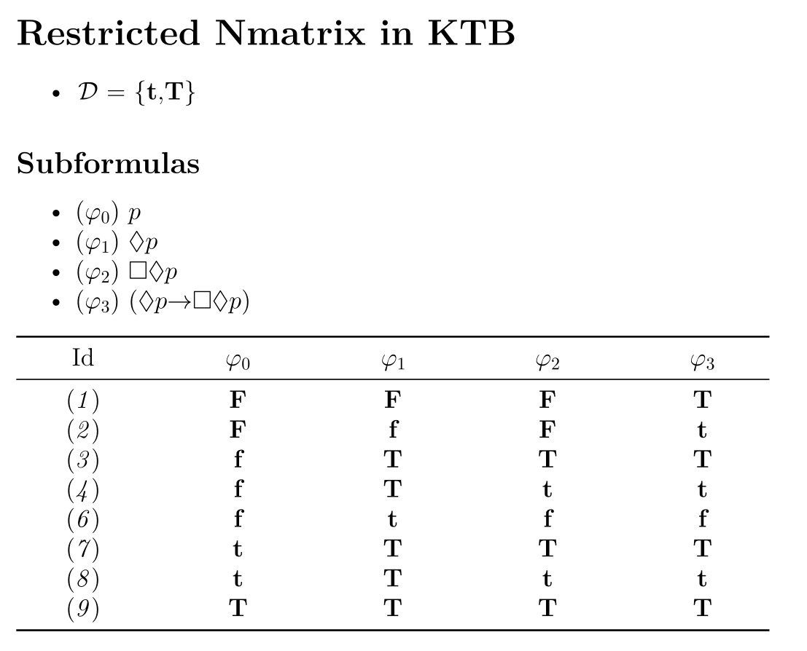
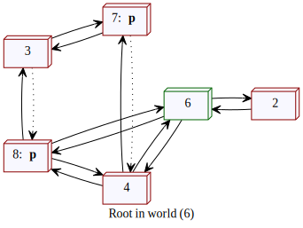
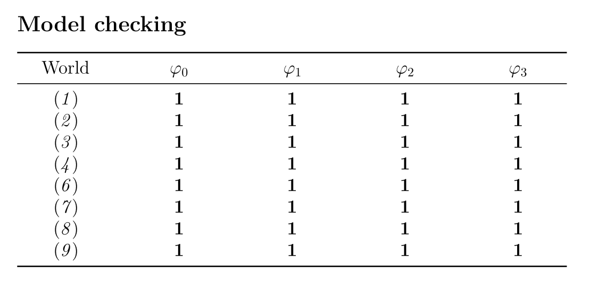

# Kearns' Nmatrix generator

This repository contains an implementation of the truth table method (Nmatrix generator and refinement algorithm developed in [1]) in Rocq ([src/forest](src/forest/)), along with an OCaml interface ([src/kearns](src/kearns/)).

## Requirements

To run [src/forest](src/forest/), you must have Rocq (formerly known as Coq) installed on your system. To run [src/kearns](src/kearns/), you need OCaml. Alternatively, a compiled binary of the interface is available in [bin/](bin/).

> **Note:** The binary was compiled for Unix (Ubuntu 24.04.2 LTS) and depends on the following tools for output generation:

1. [LaTeX](https://www.latex-project.org/get/)
2. [Pandoc](https://pandoc.org/)
3. [Graphviz](https://graphviz.org/)

Make sure these programs are available in your `PATH` before use.

## Usage

The basic usage is:

```
./kearns -l [logic] "prop"
```

Here, `[logic]` is `K` optionally combined with one or more of `D`, `B`, `T`, `4`, and `5`. The `prop` argument is a proposition defined by the following grammar:

```
prop := p | q | ~ p | <> p | [] p | p -> q | p /\ q | p \/ q
```

For example:

```
./kearns -l KTB "<> p -> []<> p"
```

produces:



The set $\mathcal{D}$ displays the designated values in the target logic. In this example, line $6$ shows a partial valuation where the proposition fails. To generate the full counter-model for this proposition, add the `-m` flag:

```
./kearns -l KTB "<> p -> []<> p" -m
```

This produces, among others, the following model:



In this figure, each node represents a partial valuation from the table and can be identified by its label (`id`). Root nodes are outlined in green. The absence of an atomic proposition in a node means the proposition is false in that partial valuation.

Dotted lines between nodes are added by a completion algorithm that builds a Kripke model based on the output of the truth table. More details can be found in [1].

### Model checking

Note that this release is a pre-alpha, hence it may contain some issues.

As a sanity check, the ``-m`` mode also produces a model-checking matrix. This matrix uses standard Kripke semantics to verify whether the truth value assigned by Kearns semantics to each formula in every partial valuation is consistent with the corresponding value in the generated Kripke model. In the example above, the following matrix is produced:



In this matrix, a value of **1** indicates that the formula has the same truth value (true or false) in the Kripke model as it does in the Nmatrix. The value **0** would indicate a problem. If you find any, please let me know!


### Optional arguments

It is possible to generate only the level $0$ by adding the flag ``-level0``. For instance,

```
./kearns -l KD45 "[](p -> q) -> ([]p -> []q)" -level0
```

This is always faster than computing the restrictions. For this this reason, it is often useful to use this flag before trying to compute the restrictions. Keep in mind that, if a formula is a tautology in the level $0$, then it is a tautology in all levels.

A silent mode, which produces the files but don't open them, is available by using the flag ``-silent``.

## References

[1] Leme, R., Olarte, C., Pimentel, E., & Coniglio, M. E. (2025). *The Modal Cube Revisited: Semantics without Worlds*. arXiv preprint [arXiv:2505.12824](https://arxiv.org/abs/2505.12824).
